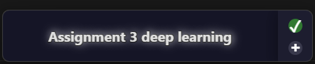

# Task Overlay App

A lightweight, always-on-top desktop widget that displays your Todoist tasks and stays out of your way.



## Features

- **Always-on-top overlay** that shows your current tasks
- **Todoist integration** to display and manage your Todoist tasks
- **Project filtering** to focus on specific projects
- **Click-through mode** that lets you interact with windows beneath the overlay
- **Right-click drag** to position the overlay anywhere on your screen
- **Left-click** to cycle through tasks
- **Add new tasks** directly from the overlay
- **Complete tasks** with a single click

## Installation

### Prerequisites

- Node.js 14.x or higher
- npm or yarn
- A Todoist account and API token

### Setup

1. Clone the repository
   ```
   git clone https://github.com/yourusername/task-overlay-app.git
   cd task-overlay-app
   ```

2. Install dependencies
   ```
   npm install
   ```

3. Create a `.env` file in the project root directory with your Todoist API key:
   ```
   TODOIST_API_KEY=your_todoist_api_token_here
   ```
   You can get your API token from Todoist settings -> Integrations -> API token

4. Run the application in development mode
   ```
   npm start
   ```

## Building the Application

To build the application for your platform:

```
npm run build
```

The built application will be available in the `dist` folder.

## Usage

### Basic Controls

- **Left-click** on the task text to cycle to the next task
- **Right-click and drag** anywhere on the task text to move the overlay
- **Green checkmark button** marks the current task as complete
- **Plus button** opens a dialog to add a new task

### System Tray

The app creates a system tray icon with additional options:
- **Open Dev Tools** - For debugging
- **Refresh Tasks** - Manually refresh tasks from Todoist
- **Filter by Project** - Choose which project's tasks to display
- **Toggle Click-Through** - Enable/disable clicking through the overlay
- **Quit** - Close the application

### Adding Tasks

1. Click the plus (+) button
2. Enter your task description
3. Select a project (optional)
4. Click "Add Task" or press Enter

## Configuration

The app automatically:
- Checks if window position is off-screen and adjusts it
- Saves window positions when expanding for task entry
- Loads your Todoist projects and tasks

## Development

### Project Structure

- `main.js` - Electron main process
- `preload.js` - Preload script for secure IPC
- `renderer.js` - UI logic
- `index.html` - Application markup
- `styles.css` - Application styling

### Modifying the App

If you want to modify the app:

1. Make your changes to the code
2. Test with `npm start`
3. Build with `npm run build`

## License

[ISC License](LICENSE)

## Credits

Built with Electron and the Todoist API.